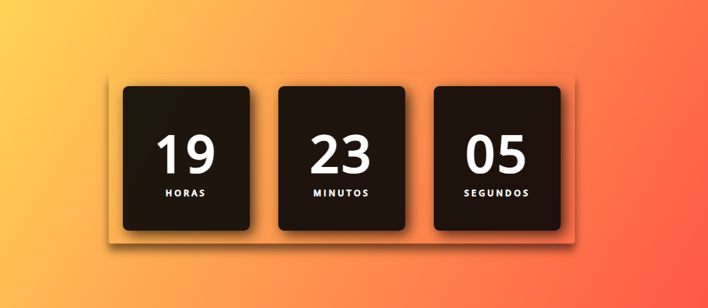

# RELOGIO VOLUME 2
😎RODE ESSE RELOGIO EM JAVASCRIPT NO SEU NAVEGADOR.

 <br>

## DESCRIÇÃO:
Este é um simples relógio digital que exibe a hora atual.

1. **Elementos Visuais:** O relógio é exibido na página da web com três seções para horas, minutos e segundos.
2. **Atualização Automática:** O relógio é atualizado a cada segundo para exibir a hora atual.

## COMO USAR?
* Clone o repositório para o seu sistema local:

```bash
git clone https://github.com/VILHALVA/RELOGIO-VOLUME-2.git
```

* Navegue até o diretório do projeto.

```bash
cd RELOGIO-VOLUME-2
```

* Descompacte o arquivo ZIP (se você baixou manualmente):

```bash
unzip RELOGIO-VOLUME-2.zip
```

* Abra o arquivo `CODIGO.html` em seu navegador de preferência.
* O relógio começará a exibir a hora atual e será atualizado a cada segundo.
* As horas, minutos e segundos serão mostrados em seções separadas na página.

## NÃO SABE?
- Entendemos que para manipular arquivos em `HTML`, `CSS` e outras linguagens relacionadas, é necessário possuir conhecimento nessas áreas. Para auxiliar nesse aprendizado, oferecemos cursos gratuitos disponíveis:
* [Curso de HTML e CSS](https://github.com/VILHALVA/CURSO-DE-HTML-E-CSS)
* [Curso de JavaScript](https://github.com/VILHALVA/CURSO-DE-JAVASCRIPT)
* [Confira mais cursos](https://github.com/VILHALVA?tab=repositories&q=+topic:CURSO)

## CREDITOS:
- [PROJETO FEITO PELO CANAL LARISSA KICH](https://youtu.be/GK0ok3ZCXwM?si=iXp38lO3O_dfcvnc)
- [PROJETO BAIXADO DE LARISSA KICH](https://github.com/Larissakich/relogiodigital)
- [PROJETO PUBLICADO PELO VILHALVA](https://github.com/VILHALVA)
- [ESTÁ DISPONIVEL NO SITE](https://vilhalva.github.io/STYLER/STYLER.html)


